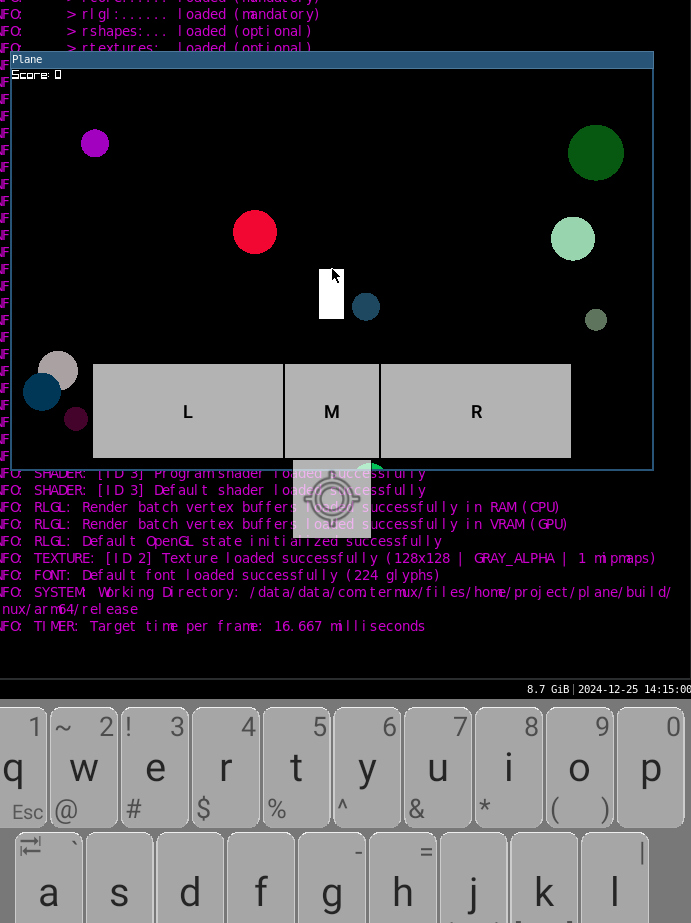

# Very Basic Raylib Game

This is my very first raylib game

### Some Image
 

### How to build
- You need xmake 
- clone this repo
```sh
git clone https://github.com/AqeAyen/Basic-Game-Raylib-.git
```
- then go to the clone directory
- type ```xmake``` to build and ```xmake run``` to run
